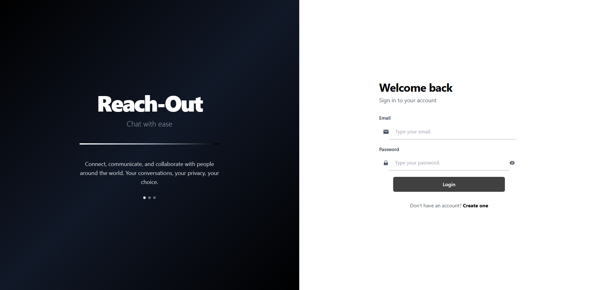

# Reach-Out - Real-Time Chat Application

A modern, full-stack real-time chat application built with React and NestJS. Connect with friends, send messages, manage friend requests, and enjoy seamless communication.

## Features

- ✨ **Real-Time Messaging** - Instant message delivery using Socket.io WebSockets
- 👥 **Friend Management** - Send, accept, and decline friend requests
- 🔐 **Secure Authentication** - JWT-based authentication with bcrypt password hashing
- 📸 **Profile Management** - Upload profile pictures and customize your profile with descriptions
- 🚫 **User Blocking** - Block users to prevent unwanted communications
- 📱 **Responsive Design** - Works seamlessly on desktop, tablet, and mobile devices
- 🎨 **Modern UI** - Clean, professional interface with dark theme for app and split-screen design for auth pages
- 💾 **Persistent Storage** - PostgreSQL database for reliable data storage

## Screenshots



*Reach-Out - Modern real-time chat interface with responsive design*

## Tech Stack

### Frontend
- **React 19.2.4** - UI library with hooks and functional components
- **TypeScript** - Type-safe development
- **Redux Toolkit** - State management for auth and chat data
- **Tailwind CSS** - Utility-first CSS framework
- **React Router DOM** - Client-side routing
- **Socket.io-client** - Real-time WebSocket communication
- **Axios** - HTTP client for API requests
- **React Hook Form** - Form validation and management

### Backend
- **NestJS 9.0.0** - Progressive Node.js framework
- **TypeScript** - Type-safe server-side code
- **PostgreSQL** - Relational database
- **Sequelize ORM** - Object-relational mapping
- **Socket.io** - WebSocket server for real-time features
- **JWT (Passport.js)** - Authentication strategy
- **bcryptjs** - Password hashing

### Cloud Services
- **Cloudinary** - Cloud image storage and optimization

## Prerequisites

- **Node.js** >= 18.x
- **npm** >= 9.x
- **PostgreSQL** >= 12.x
- **Git**

## Installation

### 1. Clone the Repository
```bash
git clone https://github.com/yourusername/reach-out.git
cd Reach_Out
```

### 2. Setup Database

Create a PostgreSQL database:
```bash
createdb reach_out
```

### 3. Setup Backend

```bash
cd server
npm install
```

Create a `.env` file in the `server` directory:
```env
DB_PASSWORD
CLIENT_BASE_URL
JWT_SECRET
```

Start the backend server:
```bash
npm run start:dev
```

The server will run on `http://localhost:5000`

### 4. Setup Frontend

```bash
cd client
npm install
```

Create a `.env` file in the `client` directory:
```env
REACT_APP_API_BASE_URL
REACT_APP_CLOUD_NAME
REACT_APP_UPLOAD_PRESET

```

Start the frontend development server:
```bash
npm start
```

The application will open on `http://localhost:3000`

## Project Structure

```
Reach_Out/
├── client/                          # React frontend application
│   ├── src/
│   │   ├── components/             # Reusable UI components
│   │   │   ├── buttons/
│   │   │   ├── inputs/             # Form inputs (TextInput, PasswordInput, etc.)
│   │   │   └── layout/             # Layout components (Sidebar, ContentArea)
│   │   ├── pages/                  # Page components
│   │   │   ├── Login/
│   │   │   ├── Register/
│   │   │   ├── Chat/
│   │   │   ├── Profile/
│   │   │   └── ...
│   │   ├── services/               # API service functions
│   │   ├── redux/                  # Redux store and slices
│   │   ├── utils/                  # Utility functions and constants
│   │   ├── hooks/                  # Custom React hooks
│   │   ├── lib/                    # Library configurations (Socket.io)
│   │   ├── index.css               # Global styles
│   │   └── auth-pages.css          # Authentication pages styles
│   └── package.json
│
└── server/                          # NestJS backend application
    ├── src/
    │   ├── auth/                   # Authentication module
    │   │   ├── auth.controller.ts
    │   │   ├── auth.service.ts
    │   │   └── strategies/         # Passport strategies
    │   ├── user/                   # User module
    │   │   ├── user.controller.ts
    │   │   ├── user.service.ts
    │   │   └── user.entity.ts
    │   ├── channel/                # Channel/Chat module
    │   │   ├── channel.controller.ts
    │   │   ├── channel.service.ts
    │   │   └── channel.gateway.ts  # WebSocket gateway
    │   ├── message/                # Message module
    │   │   ├── message.controller.ts
    │   │   ├── message.service.ts
    │   │   └── message.entity.ts
    │   ├── database/               # Database configuration
    │   └── main.ts
    └── package.json
```

## Getting Started

### 1. Register a New Account
- Go to the Register page
- Enter your email, username, and password
- Click "Create Account"

### 2. Login
- Go to the Login page
- Enter your credentials
- Click "Login"

### 3. Add Friends
- Navigate to "Add Friend" section
- Search for users by username or email
- Send a friend request

### 4. Manage Friend Requests
- View pending friend requests in your profile
- Accept or decline requests
- Optionally block users

### 5. Start Chatting
- Select a friend from your friends list
- Start typing and send messages in real-time
- Chat updates instantly for both users

### 6. Manage Your Profile
- Click on your profile
- Upload a profile picture
- Update your bio/description
- Changes are saved automatically

## Key Features Explained

### Real-Time Chat
Messages are delivered instantly using Socket.io WebSockets, providing a seamless chat experience.

### Bidirectional Friendships
Friend requests create bidirectional relationships. Once accepted, both users can message each other.

### Friend Management
- **Send Request**: Initiate a connection with another user
- **Accept/Decline**: Manage incoming friend requests
- **Block Users**: Prevent specific users from contacting you

### Image Uploads
Profile pictures are uploaded to Cloudinary, ensuring reliable cloud storage and optimization.

### Authentication
- Passwords are hashed using bcrypt (salt rounds: 10)
- JWT tokens expire after 3 days
- Secure API endpoints with authentication guards

## API Endpoints

### Authentication
- `POST /auth/register` - Create a new account
- `POST /auth/login` - Login and receive JWT token

### Users
- `GET /user/:id` - Get user profile
- `PATCH /user/:id` - Update user profile
- `POST /user/friend/add` - Add/remove friend
- `POST /user/request/send` - Send/accept friend request

### Messages
- `POST /message` - Send a message
- `GET /message/:channelId` - Get messages for a channel

### Channels
- `GET /channel` - Get all channels
- `POST /channel` - Create a new channel

## WebSocket Events

### Client → Server
- `send_message` - Send a message to a channel
- `join_channel` - Join a chat channel
- `leave_channel` - Leave a chat channel
- `friend_request` - Send friend request notification
- `accept_request` - Accept friend request notification

### Server → Client
- `message_received` - Receive new message
- `friend_request_received` - Receive friend request
- `request_accepted` - Friend request accepted
- `user_online` - User came online
- `user_offline` - User went offline

```

## Contributing

1. Fork the repository
2. Create a feature branch (`git checkout -b feature/amazing-feature`)
3. Commit your changes (`git commit -m 'Add amazing feature'`)
4. Push to the branch (`git push origin feature/amazing-feature`)
5. Open a Pull Request

## Author

**Jatin**

- GitHub: [@jatin](https://github.com/jatinpathania/)


## Acknowledgments

- [NestJS](https://nestjs.com/) - Progressive Node.js framework
- [React](https://react.dev/) - JavaScript library for building user interfaces
- [Tailwind CSS](https://tailwindcss.com/) - Utility-first CSS framework
- [Socket.io](https://socket.io/) - Real-time communication platform
- [Cloudinary](https://cloudinary.com/) - Cloud image platform

---

**Happy chatting! 💬**
